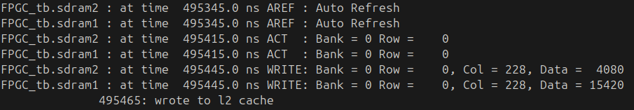
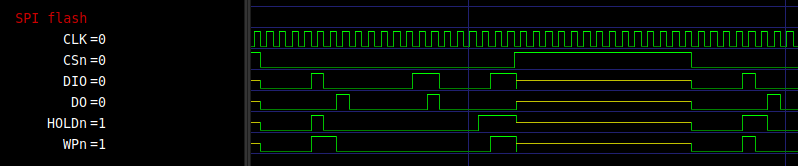

# Verilog build/simulate instructions

To simulate the design, iverilog is used. Use version >= 12.0

To run the simulation (in this case a testbench of the entire FPGC), run 

```bash
iverilog -o /home/bart/Documents/FPGA/FPGC6/Verilog/output/output \
  /home/bart/Documents/FPGA/FPGC6/Verilog/testbench/FPGC_tb.v \
  && vvp /home/bart/Documents/FPGA/FPGC6/Verilog/output/output
```

Display statements will be printed to the terminal by `vvp`.



## Waveform viewer

Assuming the testbench generates a `wave.vcd`, you can use `GTKWave` to view the waveform.

```bash
gtkwave /home/bart/Documents/FPGA/FPGC6/Verilog/output/FPGC.gtkw --dark
```



Tip: use `ctrl+shft+r` to reload the waveform when overwritten by a new simulation.