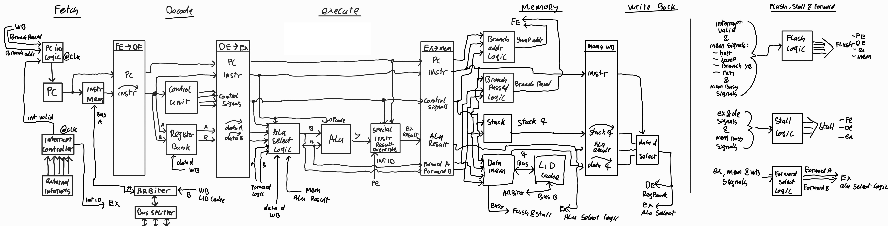

# Pipeline
The B32P has a 5-stage pipeline, very similar to a MIPS CPU. The stages are as follows:

- FE (fetch): Obtain instruction from memory bus
- DE (decode): Decode instruction and read register bank
- EX (execute): ALU operation and jump/branch calculation
- MEM (memory access): Stack access and memory bus access
- WB (write back): Write to register bank

A full schematic overview of how all the CPU components fall within this pipeline can be seen in this image. (You might want to right-click the image and open in a new tab to zoom in)

## Hazard detection and branch prediction
The CPU detects pipeline hazards, removing the need for the programmer to account for this, by doing the following things depending on the situation:

- Flush (if jump/branch/halt)
- Stall (if EX uses result of MEM)
- Forwarding (MEM -> EX and WB -> EX)

Branch prediction is done by always assuming that the branch did not pass (which is the easiest to implement).

## Memory conflicts
Because the FPGC does not have a separate instruction and data memory, the FE and MEM stages could need access to the memory bus at the same time.
To handle this, an arbiter is used that gives priority to the MEM request, since these only occur for READ/WRITE instructions, and lets the FE request stall until the bus is free.

## Memory latency
Access to memory via the memory bus will take a variable amount of cycles depending on the memory type that is being accessed. The pipeline will stall during this delay.